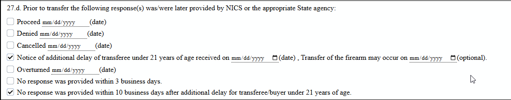
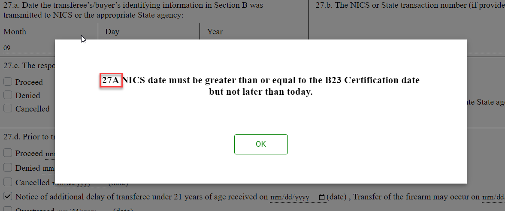

# Rapid POS e4473 Integration Release Notes  

*Release Date: September 23, 2025*

---

## What's New

### e4473 Cashier Portal:

- BugFix: Resolved an issue where checking “No response was provided… 10 days…” on 27d. did not allow Section D to be completed.

- Bug Fix: Removed validation to require entry for date fields that were optional on 27d.
- Bug Fix: Added verbiage on Section C error to reference question where action needed to be taken.

- Added message on Section D and E to disallow edits after Section E has been signed.
